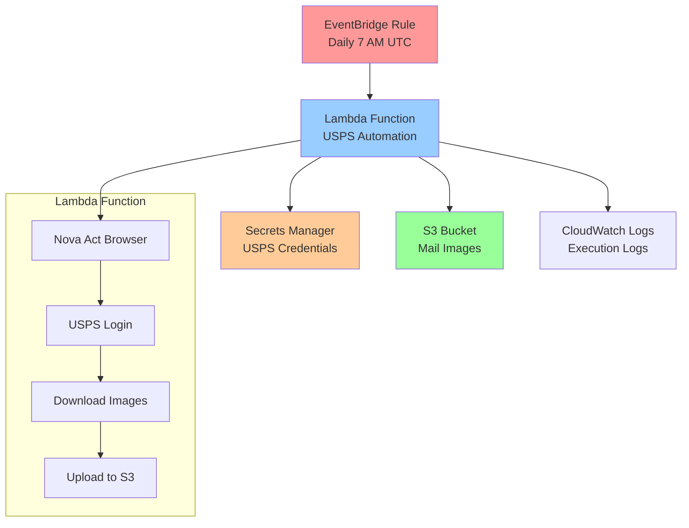

# Design Document: USPS Lambda Terraform Deployment

## Overview

This design outlines the architecture for deploying the existing USPS Informed Delivery automation script to AWS Lambda using Terraform infrastructure as code. The solution transforms the local Nova Act automation into a serverless, scheduled service that stores mail images in S3.

The system consists of:
- AWS Lambda function running the adapted USPS automation script
- S3 bucket for storing downloaded mail images
- EventBridge rule for daily scheduling at 7 AM UTC
- Secrets Manager for secure credential storage
- CloudWatch for logging and monitoring
- IAM roles and policies for secure access

## Architecture



## Components and Interfaces

### Lambda Function
- **Runtime**: Python 3.10
- **Memory**: 3008 MB (maximum for browser automation)
- **Timeout**: 15 minutes (maximum Lambda timeout)
- **Handler**: `lambda_function.lambda_handler`
- **Environment Variables**: S3_BUCKET_NAME, AWS_REGION
- **Layers**: Custom layer with Nova Act dependencies

### S3 Bucket
- **Naming**: `usps-mail-images-{random-suffix}`
- **Versioning**: Enabled for data protection
- **Encryption**: AES-256 server-side encryption
- **Lifecycle Policy**: Transition to IA after 30 days, Glacier after 90 days
- **Folder Structure**: `YYYY-MM-DD/mail_image_N_timestamp.png`

### EventBridge Rule
- **Schedule**: `cron(0 7 * * ? *)` (7 AM UTC daily)
- **Target**: Lambda function with retry policy
- **Input**: JSON payload with execution metadata

### Secrets Manager
- **Secret Name**: `usps-automation-credentials`
- **Format**: JSON with `username` and `password` keys
- **Encryption**: AWS managed KMS key
- **Access**: Lambda execution role only

### IAM Roles and Policies
- **Lambda Execution Role**: Basic execution + S3 + Secrets Manager access
- **S3 Policy**: PutObject, GetObject permissions on specific bucket
- **Secrets Policy**: GetSecretValue permission on USPS credentials secret

## Data Models

### Lambda Event Structure
```json
{
  "source": "aws.events",
  "detail-type": "Scheduled Event",
  "detail": {},
  "time": "2024-12-28T07:00:00Z"
}
```

### Lambda Response Structure
```json
{
  "statusCode": 200,
  "body": {
    "success": true,
    "images_downloaded": 5,
    "s3_uploads": 5,
    "execution_time": "245.67",
    "date": "2024-12-28"
  }
}
```

### S3 Object Metadata
```json
{
  "Content-Type": "image/png",
  "x-amz-meta-download-date": "2024-12-28",
  "x-amz-meta-source": "usps-informed-delivery",
  "x-amz-meta-automation-version": "1.0"
}
```

### Secrets Manager Secret Structure
```json
{
  "username": "user@example.com",
  "password": "secure_password"
}
```

## Correctness Properties

*A property is a characteristic or behavior that should hold true across all valid executions of a system-essentially, a formal statement about what the system should do. Properties serve as the bridge between human-readable specifications and machine-verifiable correctness guarantees.*

### Property 1: Infrastructure Deployment Completeness
*For any* Terraform apply operation, all required AWS resources (Lambda function, S3 bucket, EventBridge rule, IAM roles, Secrets Manager secret) should be created with correct configurations
**Validates: Requirements 1.1, 2.1, 3.1, 5.2**

### Property 2: Lambda Function Configuration
*For any* deployed Lambda function, it should have Python 3.10+ runtime, 3008MB memory, 15-minute timeout, and proper IAM permissions for S3 and Secrets Manager access
**Validates: Requirements 1.3, 1.4, 1.5, 4.3**

### Property 3: S3 Storage Organization
*For any* file uploaded to S3, it should be stored in the correct date-based folder structure (YYYY-MM-DD/filename) with appropriate metadata
**Validates: Requirements 2.2, 2.3, 7.2**

### Property 4: S3 Configuration Properties
*For any* created S3 bucket, it should have versioning enabled, lifecycle policies configured, and server-side encryption enabled
**Validates: Requirements 2.4, 2.5**

### Property 5: Scheduling Configuration
*For any* EventBridge rule, it should be configured with the correct cron expression for 7 AM UTC daily execution and target the Lambda function without automatic retry
**Validates: Requirements 3.1, 3.2, 3.3, 3.5**

### Property 6: Credential Security
*For any* credential access operation, the Lambda function should retrieve credentials from Secrets Manager using IAM authentication and never log credential values
**Validates: Requirements 4.1, 4.2, 4.4, 4.5**

### Property 7: Terraform Module Structure
*For any* Terraform module, it should define variables for configurable parameters, output important resource identifiers, and cleanly destroy all resources except S3 data
**Validates: Requirements 5.1, 5.3, 5.4, 5.5**

### Property 8: Comprehensive Logging
*For any* Lambda execution, it should log to CloudWatch with 30+ day retention, include detailed error information when errors occur, and log success metrics when images are downloaded
**Validates: Requirements 6.1, 6.2, 6.3, 6.4**

### Property 9: Lambda Runtime Adaptation
*For any* Lambda execution, the function should properly handle Lambda event/context parameters, return appropriate status codes, and handle timeout constraints gracefully
**Validates: Requirements 7.1, 7.3, 7.4**

### Property 10: Nova Act Lambda Configuration
*For any* Nova Act initialization in Lambda, it should use headless browser mode and have access to all required dependencies
**Validates: Requirements 1.2, 7.5**

### Property 11: Error Handling and Resilience
*For any* error condition (network errors, login failures, no images available), the Lambda function should handle it gracefully, log appropriately without exposing credentials, and complete execution properly
**Validates: Requirements 8.1, 8.2, 8.3**

### Property 12: S3 Upload Retry Logic
*For any* S3 upload failure, the Lambda function should retry the operation up to 3 times before failing
**Validates: Requirements 8.4**

### Property 13: CloudWatch Monitoring
*For any* Lambda execution, custom CloudWatch metrics should be published for monitoring success/failure, and alarms should be configured for critical errors
**Validates: Requirements 6.5, 8.5**

## Error Handling

### Lambda Function Errors
- **Timeout Handling**: Monitor execution time and gracefully shutdown before 15-minute limit
- **Memory Errors**: Use maximum Lambda memory (3008MB) for browser automation
- **Nova Act Failures**: Catch and log Nova Act exceptions with appropriate error codes
- **Network Errors**: Implement exponential backoff for transient network issues

### S3 Upload Errors
- **Retry Logic**: Implement exponential backoff with jitter for S3 upload failures
- **Partial Failures**: Continue processing remaining images if individual uploads fail
- **Permission Errors**: Log IAM permission issues with actionable error messages
- **Storage Errors**: Handle S3 service errors and quota limitations

### Credential Errors
- **Secrets Manager Failures**: Handle service unavailability and permission errors
- **Invalid Credentials**: Log authentication failures without exposing credential values
- **Rotation Handling**: Support automatic credential rotation in Secrets Manager

### Infrastructure Errors
- **Terraform State**: Use remote state backend for team collaboration
- **Resource Conflicts**: Handle naming conflicts with random suffixes
- **Dependency Failures**: Proper resource dependencies to avoid creation order issues

## Testing Strategy

### Dual Testing Approach
The testing strategy combines unit tests for specific functionality and property-based tests for universal correctness properties:

- **Unit Tests**: Verify specific examples, edge cases, and error conditions
- **Property Tests**: Verify universal properties across all inputs using Terraform testing framework and AWS CLI validation

### Unit Testing Focus
Unit tests should focus on:
- Terraform module validation with specific input combinations
- Lambda function handler with mock events and contexts
- S3 upload functionality with test files
- Error handling with simulated failure conditions
- Credential retrieval with mock Secrets Manager responses

### Property-Based Testing Configuration
- **Framework**: Use Terraform's built-in testing framework and AWS CLI for validation
- **Minimum Iterations**: 100 test runs per property test
- **Test Tags**: Each property test references its design document property
- **Tag Format**: **Feature: usps-lambda-terraform, Property {number}: {property_text}**

### Property Test Implementation
Each correctness property will be implemented as a property-based test:
- **Infrastructure Properties**: Use `terraform plan` and `terraform show` to validate resource configurations
- **Runtime Properties**: Use Lambda test events and CloudWatch log analysis
- **Security Properties**: Use AWS CLI to validate IAM policies and encryption settings
- **Integration Properties**: Use end-to-end test scenarios with mock USPS responses

### Test Environment
- **Isolated AWS Account**: Use dedicated test account to avoid conflicts
- **Terraform Workspaces**: Separate workspaces for different test scenarios
- **Cleanup Automation**: Automatic resource cleanup after test completion
- **State Management**: Isolated Terraform state for each test run

### Continuous Validation
- **Pre-deployment**: Run all tests before applying Terraform changes
- **Post-deployment**: Validate deployed resources match expected configurations
- **Monitoring**: Continuous monitoring of deployed resources for drift detection
- **Alerting**: Automated alerts for test failures and configuration drift