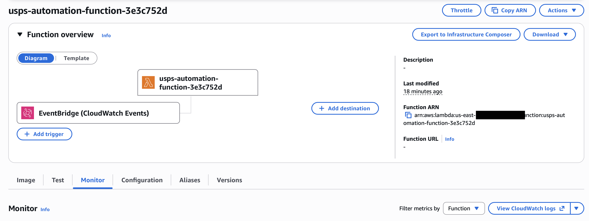
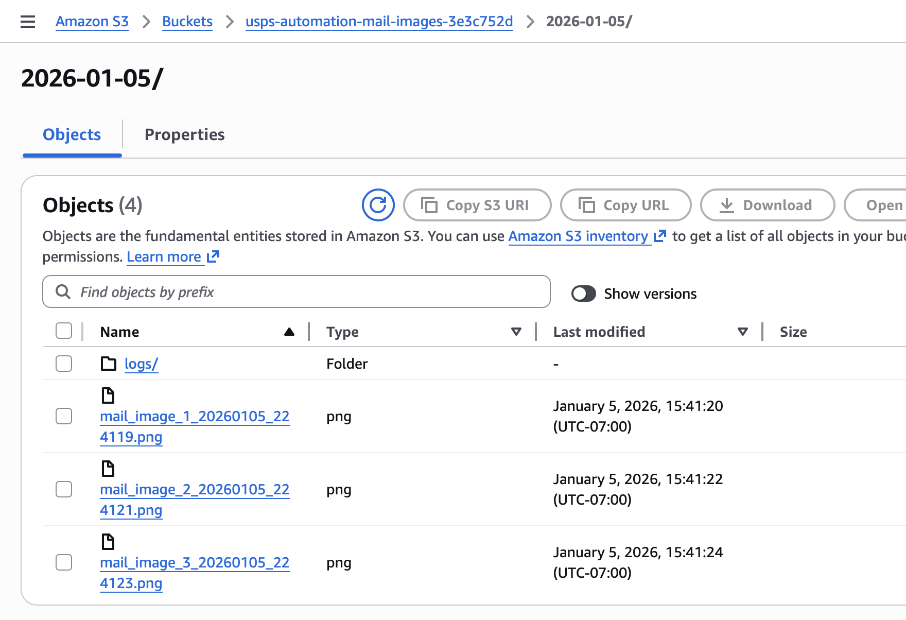
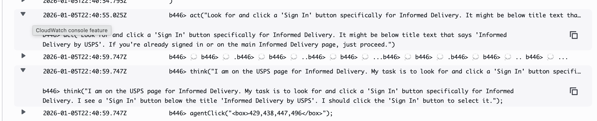

# Revolutionizing Web Automation with Amazon Nova Act: Beyond APIs to Intelligent Browser Control

In the world of web automation, we've long been constrained by the availability of APIs. What happens when the data you need is locked behind complex web interfaces, dynamic content, or simply doesn't have a public API? Enter **[Amazon Nova Act](https://nova.amazon.com)** – a game-changing AI-powered browser automation tool that thinks and acts like a human, making web scraping and automation more intelligent than ever before.

## The Problem with Traditional Web Automation

Traditional web automation tools like Selenium or Playwright require developers to:
- Write brittle CSS selectors that break when websites change
- Handle complex JavaScript-rendered content manually  
- Create extensive conditional logic for different page states
- Maintain fragile scripts that need constant updates

But what if your automation could **understand** web pages like a human does? What if it could analyze images, read content contextually, and make intelligent decisions about what actions to take?

## Introducing Amazon Nova Act: AI-Powered Browser Automation

[Amazon Nova Act](https://nova.amazon.com) represents a paradigm shift in web automation. Instead of rigid selectors and predefined workflows, Nova Act uses advanced AI to:

- **Understand natural language instructions** for web interactions
- **Analyze visual content** including images and page layouts
- **Make contextual decisions** based on what it "sees" on the page
- **Adapt to website changes** without code modifications

## Real-World Example: USPS Informed Delivery Automation

Let me show you how powerful Nova Act is through a real project I built – an automated system that logs into USPS Informed Delivery, finds mail images, and intelligently filters them based on content.

> **📁 Complete Source Code:** You can find the full implementation of this USPS automation project on GitHub: [GenAI-Nova-Act-Download-Incoming-USPS-Mail](https://github.com/DannyDenver/GenAI-Nova-Act-Download-Incoming-USPS-Mail)

### The Challenge

USPS Informed Delivery shows preview images of your incoming mail, but there's no API to access this data. The web interface is complex, requires authentication, and contains many images – not all of which are actual mail pieces. Some are logos, banners, or empty placeholders.

### The Nova Act Solution

Here's how Nova Act transforms this complex task into simple, readable code:

#### 1. Intelligent Image Analysis

Instead of trying to write complex image processing algorithms, Nova Act can analyze images using natural language:

```python
def _should_include_image(self, img, image_num: int) -> bool:
    """Determine if an image should be included based on content analysis."""
    # First, check if the image source or alt text suggests it's a mail piece
    src = img.get_attribute('src') or ''
    alt = img.get_attribute('alt') or ''
    
    # Skip obvious non-mail images
    skip_keywords = ['logo', 'banner', 'icon', 'button', 'nav']
    if any(keyword in src.lower() or keyword in alt.lower() for keyword in skip_keywords):
        logger.info(f"✗ Skipping image {image_num} - appears to be UI element: {src}")
        return False
    
    # Use Nova Act to analyze the image content for address information
    analysis_result = self.nova_act.act(
        f"Examine this mail image carefully. Look for addressing information such as: "
        f"- Recipient name and address "
        f"- Street address, city, state, zip code "
        f"- Return address information "
        f"- Any text that looks like mailing labels "
        f"Respond with 'HAS_ADDRESS' if you can clearly see addressing information, "
        f"or 'NO_ADDRESS' if it's blank, just a logo, or contains no addressing text.",
        element=img
    )
    
    # Check if Nova Act found address information
    analysis_text = str(analysis_result).upper()
    has_address = ('HAS_ADDRESS' in analysis_text or 
                  any(keyword in analysis_text for keyword in ['ADDRESS', 'RECIPIENT', 'STREET', 'ZIP']))
    
    if has_address:
        logger.info(f"✓ Image {image_num} contains address information: {analysis_result}")
        return True
    else:
        logger.info(f"✗ Image {image_num} filtered out - no address information: {analysis_result}")
        return False
```

**This is remarkable!** With just a natural language prompt, Nova Act can:
- Examine each mail image visually
- Identify whether it contains addressing information
- Distinguish between actual mail pieces and UI elements
- Provide detailed reasoning for its decisions

#### 2. Natural Language Navigation

Instead of fragile CSS selectors, Nova Act understands instructions like a human would:

```python
def attempt_login(self) -> bool:
    """Attempt to login with credentials."""
    try:
        # Find and focus username field
        username_field = self.nova_act.act("Find the username input field and click on it to focus it.")
        logger.info(f"Username field focused: {username_field}")
        
        # Type username
        self.nova_act.page.keyboard.type(self.username)
        logger.info("Username entered")
        
        # Find and focus password field
        password_field = self.nova_act.act("Now find the password input field and click on it to focus it.")
        logger.info(f"Password field focused: {password_field}")
        
        # Type password
        self.nova_act.page.keyboard.type(self.password)
        logger.info("Password entered")
        
        # Submit form
        submit_result = self.nova_act.act("Click the sign in button to submit the login form.")
        logger.info(f"Submit result: {submit_result}")
```

Notice how readable this is! No CSS selectors, no XPath expressions – just natural language instructions that Nova Act interprets and executes.

#### 3. Contextual Page Understanding

Nova Act can understand complex page states and make decisions:

```python
# Check what's available on the page
mail_check = self.nova_act.act(
    "I am now in my Informed Delivery section. Look for today's mail images "
)
logger.info(f"Mail check: {mail_check}")
```

Nova Act examines the entire page context and provides intelligent feedback about what it finds.

## Security: Credentials Stay in Your Code

One of the most important aspects of Nova Act is **security**. Nova Act doesn't have direct access to your credentials – you maintain complete control:

```python
class USPSAuthenticator:
    """Handles USPS website authentication and navigation."""
    
    def __init__(self, nova_act: NovaAct, username: str, password: str):
        self.nova_act = nova_act
        self.username = username  # Credentials stay in your code
        self.password = password  # Nova Act never sees these directly
```

**How it works:**
1. **You** retrieve credentials from secure storage (AWS Secrets Manager, environment variables, etc.)
2. **Your code** types the credentials using standard Playwright keyboard methods
3. **Nova Act** only handles the navigation and element finding
4. **Credentials never leave your environment** or get sent to Nova Act's servers

This architecture ensures that sensitive information remains under your complete control while still benefiting from Nova Act's intelligent automation capabilities.

## The Power of AI-Driven Automation

### Before Nova Act:
```python
# Brittle, hard to maintain
username_field = driver.find_element(By.CSS_SELECTOR, "#username")
if not username_field:
    username_field = driver.find_element(By.CSS_SELECTOR, "input[name='username']")
if not username_field:
    username_field = driver.find_element(By.CSS_SELECTOR, "input[type='email']")
# ... dozens more fallback selectors
```

### With Nova Act:
```python
# Intelligent, adaptive, readable
username_field = nova_act.act("Find the username input field and click on it to focus it.")
```

## Real-World Benefits

### 1. **Reduced Maintenance**
When websites change their layout or CSS classes, Nova Act adapts automatically. No more broken selectors!

### 2. **Intelligent Decision Making**
Nova Act can analyze content and make decisions that would require complex computer vision algorithms.

### 3. **Natural Language Programming**
Write automation scripts that read like human instructions, making them easier to understand and maintain.

### 4. **Visual Understanding**
Nova Act can "see" and analyze images, charts, and visual elements that traditional automation tools struggle with.

## Deployment at Scale: AWS Lambda Integration

This USPS automation runs as a serverless AWS Lambda function, demonstrating how Nova Act can be deployed at enterprise scale:

```python
# Serverless, scheduled automation
def lambda_handler(event, context):
    """AWS Lambda handler function."""
    automator = LambdaUSPSAutomator(s3_bucket, secret_name, aws_region)
    result = automator.run()
    
    return {
        'statusCode': 200 if result['success'] else 500,
        'body': json.dumps(result)
    }
```



The system runs daily, automatically:
- Logs into USPS Informed Delivery
- Analyzes mail images using AI
- Filters out non-mail content
- Stores relevant images in S3
- Provides detailed execution logs

### EventBridge Scheduling: Set It and Forget It

The Lambda function is triggered by **Amazon EventBridge** on a daily schedule (7 AM UTC by default). This serverless scheduling means:

- **No infrastructure to manage** - EventBridge handles the timing
- **Reliable execution** - Built-in retry logic and error handling
- **Flexible scheduling** - Easy to adjust timing via Terraform configuration
- **Cost-effective** - Pay only for executions, not idle time

```hcl
# Terraform configuration for daily scheduling
resource "aws_cloudwatch_event_rule" "schedule" {
  name                = "usps-automation-schedule"
  description         = "Schedule for USPS automation Lambda"
  schedule_expression = "cron(0 7 * * ? *)"  # 7 AM UTC daily
}
```

### S3 Storage and Organization

All captured mail images and automation logs are stored in S3 with intelligent organization:



The system creates a clean folder structure:
```
s3://usps-mail-images-bucket/
├── 2024-01-05/
│   ├── mail_image_1_20240105_070123.png
│   ├── mail_image_2_20240105_070124.png
│   └── logs/
│       ├── session_log.json
│       ├── action_trace.html
│       └── screenshots/
```

Here's an example of a captured mail image showing how Nova Act successfully identified and extracted a piece with addressing information:


### Comprehensive Logging and Debugging

Nova Act provides detailed logs that are automatically uploaded to S3, giving you complete visibility into the automation process:



These logs include:
- **HTML traces** showing each step of the automation
- **Screenshot captures** of browser interactions  
- **JSON logs** with detailed execution data
- **Error debugging** information for failed runs

## Building Event-Driven Workflows: Beyond Simple Scheduling

The real power of this architecture becomes apparent when you extend it into event-driven workflows. Here's how you can build a complete mail processing pipeline:

### 1. EventBridge Scheduled Trigger
```
EventBridge (7 AM daily) → Lambda (Nova Act Automation) → S3 (Mail Images)
```

### 2. S3 Event-Driven Processing
Once images are stored in S3, you can trigger additional workflows:

```python
# S3 Event triggers additional processing
{
  "Rules": [
    {
      "Name": "ProcessNewMailImages",
      "EventPattern": {
        "source": ["aws.s3"],
        "detail-type": ["Object Created"],
        "detail": {
          "bucket": {"name": ["usps-mail-images-bucket"]},
          "object": {"key": [{"prefix": "mail_image_"}]}
        }
      },
      "Targets": [
        {
          "Id": "1",
          "Arn": "arn:aws:lambda:region:account:function:ProcessMailImage"
        }
      ]
    }
  ]
}
```

### 3. Downstream Processing Pipeline

**Image Analysis Lambda:**
```python
def process_mail_image(event, context):
    """Process newly uploaded mail images."""
    
    # Extract text using Amazon Textract
    textract_result = textract.analyze_document(
        Document={'S3Object': {'Bucket': bucket, 'Name': key}}
    )
    
    # Extract structured data
    addresses = extract_addresses(textract_result)
    sender_info = extract_sender_info(textract_result)
    
    # Store in database
    dynamodb.put_item(
        TableName='MailDatabase',
        Item={
            'date': date,
            'image_url': s3_url,
            'addresses': addresses,
            'sender': sender_info,
            'processed_at': datetime.now().isoformat()
        }
    )
```

**Database Integration:**
```python
# Store extracted data in DynamoDB
mail_record = {
    'mail_id': generate_unique_id(),
    'capture_date': '2024-01-05',
    'image_s3_url': 's3://bucket/2024-01-05/mail_image_1.png',
    'extracted_text': textract_results,
    'sender_address': extracted_sender,
    'recipient_address': extracted_recipient,
    'mail_type': classify_mail_type(textract_results),
    'processing_status': 'completed'
}
```

### 4. Complete Workflow Architecture

```
┌─────────────────┐    ┌──────────────────┐    ┌─────────────────┐
│   EventBridge   │───▶│  Nova Act Lambda │───▶│   S3 Storage    │
│  (Daily 7 AM)   │    │  (USPS Automation)│    │  (Mail Images)  │
└─────────────────┘    └──────────────────┘    └─────────────────┘
                                                         │
                                                         ▼
┌─────────────────┐    ┌──────────────────┐    ┌─────────────────┐
│   DynamoDB      │◀───│ Processing Lambda│◀───│   S3 Event      │
│  (Mail Database)│    │ (Text Extraction) │    │  (New Image)    │
└─────────────────┘    └──────────────────┘    └─────────────────┘
                                │
                                ▼
                       ┌─────────────────┐
                       │   Amazon SNS    │
                       │ (Notifications) │
                       └─────────────────┘
```

### 5. Advanced Use Cases

**Mail Tracking Dashboard:**
- Real-time notifications when important mail arrives
- Searchable database of all mail history
- Automatic categorization (bills, packages, personal mail)
- Integration with calendar for expected deliveries

**Business Intelligence:**
- Mail volume analytics
- Sender frequency analysis  
- Delivery pattern insights
- Cost tracking for business mail

**Security and Compliance:**
- Automatic PII detection and redaction
- Audit trails for all mail processing
- Compliance reporting for regulated industries
- Secure data retention policies

## The Complete Automation Ecosystem

What makes this Nova Act implementation truly powerful is how it fits into a larger automation ecosystem. The USPS mail capture is just the beginning – here's how you can extend it:

### Real-Time Processing Pipeline

1. **Nova Act captures mail images** (7 AM daily via EventBridge)
2. **S3 events trigger processing** (immediate upon image upload)
3. **Amazon Textract extracts text** from mail images
4. **Lambda functions parse and categorize** the extracted data
5. **DynamoDB stores structured data** for querying and analytics
6. **SNS sends notifications** for important mail (bills, packages, etc.)

### Integration Possibilities

**Home Automation:**
```python
# Trigger home automation when packages are detected
if mail_type == 'package_notification':
    # Turn on porch light
    # Send notification to phone
    # Add to delivery tracking system
```

**Financial Management:**
```python
# Automatically categorize and track bills
if mail_type == 'bill' and sender in known_billers:
    # Add to expense tracking
    # Set calendar reminders for due dates
    # Update budget forecasts
```

**Business Operations:**
```python
# Route business mail automatically  
if recipient_department == 'accounting':
    # Forward to accounting team
    # Log in document management system
    # Trigger approval workflows
```

The beauty of Nova Act is that it provides the intelligent "eyes" for your automation, while AWS services handle the scalable processing and integration.

## The Future of Web Automation

Amazon Nova Act represents the future of web automation – where AI handles the complexity while developers focus on business logic. Instead of fighting with brittle selectors and complex conditional logic, we can write automation that:
- **Thinks like a human** about web interfaces
- **Makes intelligent decisions** about content
- **Remains secure** with credentials under your control

## Getting Started

Ready to revolutionize your web automation? Here's how to get started with Nova Act:

1. **Sign up** for Nova Act at [nova.amazon.com](https://nova.amazon.com)
2. **Install** the Nova Act Python package: `pip install nova-act`
3. **Clone the example project**: `git clone https://github.com/DannyDenver/GenAI-Nova-Act-Download-Incoming-USPS-Mail`
4. **Write** natural language automation scripts
5. **Deploy** to your preferred platform (AWS Lambda, Docker, etc.)

### Quick Start with the USPS Project

```bash
# Clone the repository
git clone https://github.com/DannyDenver/GenAI-Nova-Act-Download-Incoming-USPS-Mail
cd GenAI-Nova-Act-Download-Incoming-USPS-Mail

# Set up your environment
cp terraform/terraform.tfvars.example terraform/terraform.tfvars
# Edit terraform.tfvars with your credentials and Nova Act API key

# Deploy to AWS
./deploy-container.sh
```

## Conclusion

[Amazon Nova Act](https://nova.amazon.com) isn't just another automation tool – it's a fundamental shift toward intelligent, AI-powered web interaction. By combining the reliability of traditional browser automation with the intelligence of modern AI, Nova Act enables developers to create robust, maintainable automation that adapts to the ever-changing web.

The days of brittle CSS selectors and complex conditional logic are numbered. Welcome to the age of intelligent web automation with [Amazon Nova Act](https://nova.amazon.com).

---

*Want to see the complete USPS automation project in action? Check out the [full source code on GitHub](https://github.com/DannyDenver/GenAI-Nova-Act-Download-Incoming-USPS-Mail) and see how Nova Act transforms complex web automation into simple, readable code. The repository includes everything you need: Terraform infrastructure, Docker containers, modular Python code, and detailed deployment instructions.*

**🚀 Ready to deploy?** The project includes one-click deployment scripts that set up the entire AWS infrastructure automatically. Just add your credentials and Nova Act API key, then run `./deploy-container.sh` to have your own intelligent mail automation running in minutes!